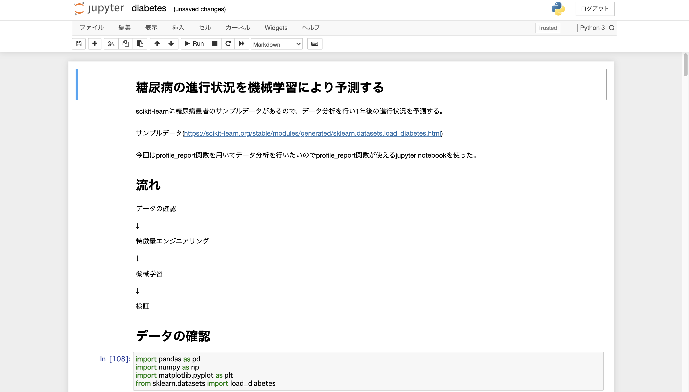
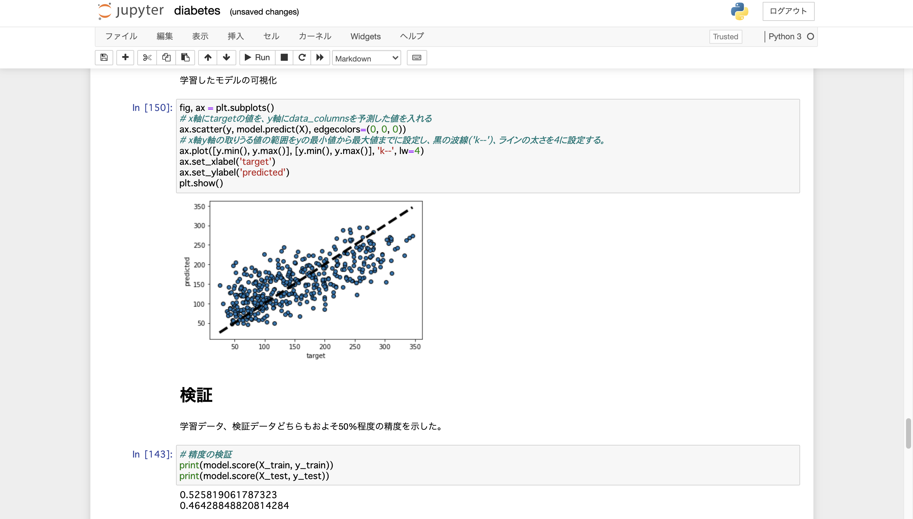

# Name
 
1.糖尿病の進行状況を機械学習により予測するアプリ  


 
# Features

diabetes.ipyb  
scikit-learnの糖尿病患者のサンプルデータをデータ分析し、1年後の進行状況を予測するファイル

# Points

特徴量エンジニアリング 、学習モデルの作成および可視化、考察
 
# 実行環境

jupyter notebook

# 注意

profile_report関数を用いたのでprofile_report関数が使えるjupyter notebookを使った。


# Requirement
 
"diabetes.ipyb "を動かすのに必要なライブラリ  

```bash
import pandas as pd
import numpy as np
import matplotlib.pyplot as plt
from sklearn.datasets import load_diabetes
from sklearn.datasets import load_diabetes
import pandas_profiling
import seaborn as sns
from sklearn import linear_model
import sklearn.model_selection
```  

# Installation
 
Requirementで列挙したライブラリなどのインストール方法
 
```bash
pip install pandas  
etc
```
 
# Usage
 
"diabetes.ipyb"の基本的な使い方
 
```bash
git clone https://github.com/tanimoyan/diabetes.git  
python3 diabetes.ipyb
```
 
# Author
 
* tanimoto